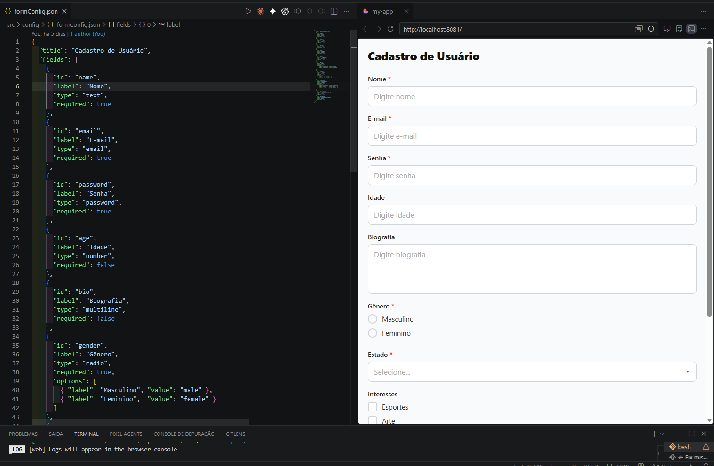
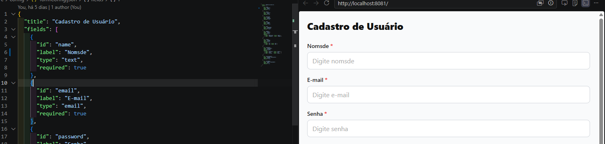
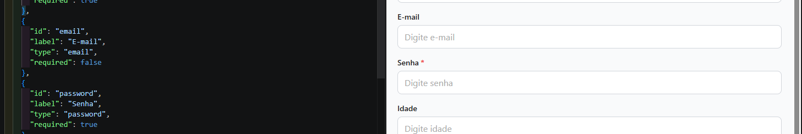
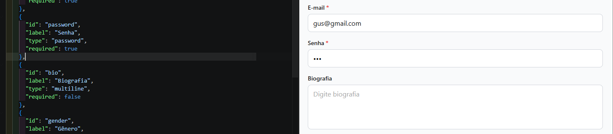
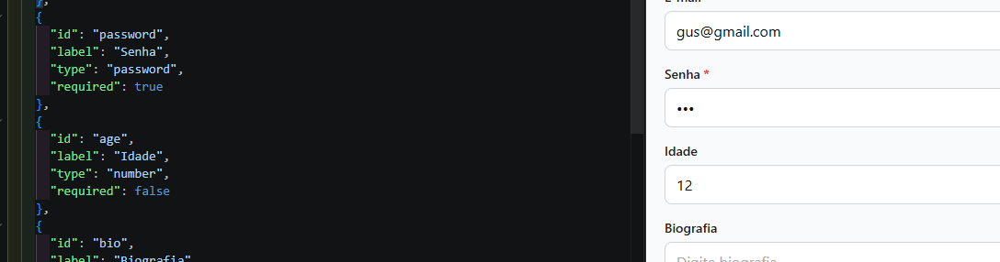
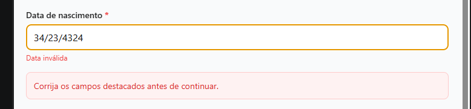
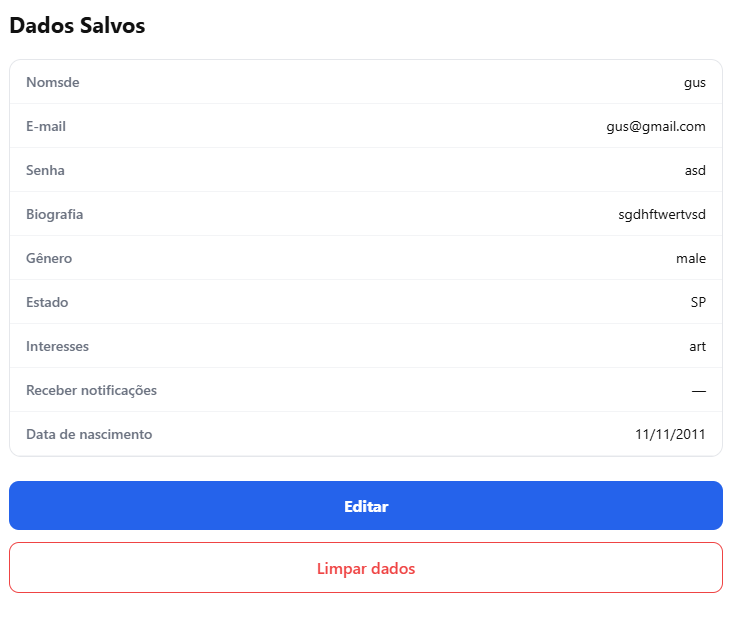
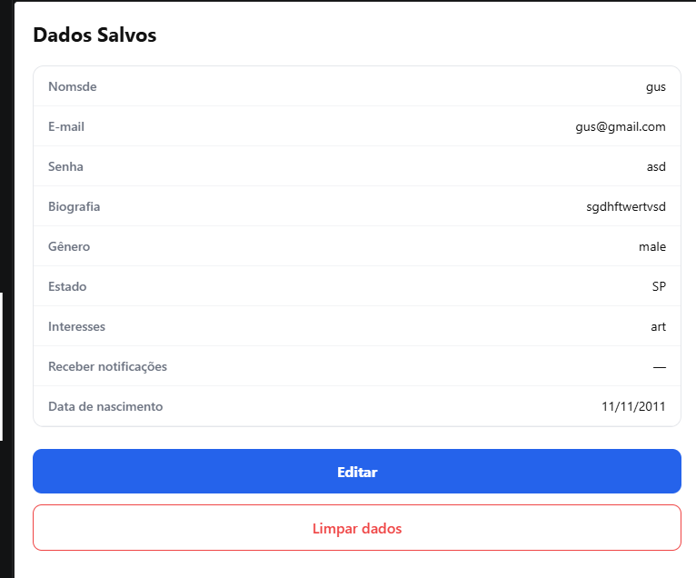
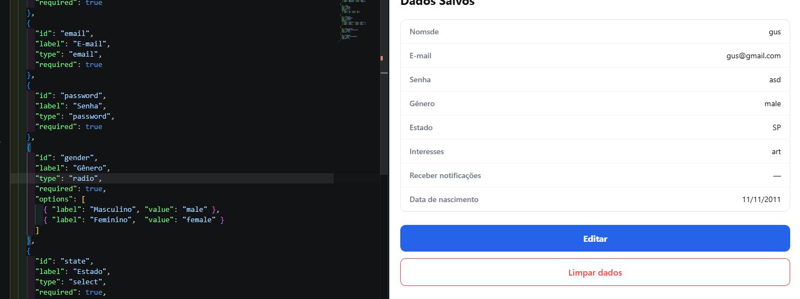
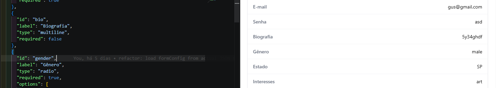

# CP3 — Formulários Dinâmicos a partir de JSON

Aplicativo mobile desenvolvido com **React Native**, **Expo SDK 55** e **TypeScript**.

O formulário é construído automaticamente a partir de uma estrutura JSON — nenhum campo é criado manualmente no código. Qualquer alteração no `formConfig.ts` reflete instantaneamente na interface, sem modificar nenhum componente.

Suporta **Android**, **iOS** e **Web** com persistência local via AsyncStorage.

---

## Integrantes

- Gustavo Bezerra Assumção — RM 553076
- Jó Sales — RM 552679
- Miguel Garcez de Carvalho — RM 553768
- Vinicius Souza e Silva — RM 552781

---

## Tecnologias utilizadas

| Pacote | Versão | Finalidade |
|---|---|---|
| `expo` | ~55.0.8 | Toolchain, runtime e build multiplataforma |
| `react-native` | 0.83.2 | Framework mobile para Android, iOS e Web |
| `react` | 19.2.0 | Biblioteca de UI |
| `typescript` | ~5.9.2 | Tipagem estática estrita — sem uso de `any` |
| `@react-native-async-storage/async-storage` | 2.2.0 | Persistência local de dados |
| `react-native-safe-area-context` | ~5.6.2 | Safe area em iOS e Android |
| `react-native-web` | ^0.21.0 | Renderização no navegador |

---

## Como executar o projeto

### Pré-requisitos

- Node.js 18 ou superior
- [Expo Go](https://expo.dev/client) no celular **ou** emulador/simulador configurado

### Instalação

```bash
git clone <url-do-repositorio>
cd TaskFlow
npm install
```

### Executar em todas as plataformas

```bash
npx expo start
```

No terminal interativo, pressione:

| Tecla | Plataforma |
|---|---|
| `a` | Android (emulador ou dispositivo via Expo Go) |
| `i` | iOS (simulador — requer macOS) |
| `w` | Web (abre no navegador padrão) |

### Executar direto no navegador

```bash
npx expo start --web
```

### Executar direto no Android

```bash
npx expo start --android
```

### Executar direto no iOS

```bash
npx expo start --ios
```

### Verificar tipagem TypeScript

```bash
npx tsc
```

---

## Formulário Dinâmico

O formulário é gerado 100% a partir do JSON em `src/config/formConfig.ts`.

Para adicionar, remover ou modificar campos, edite **apenas esse arquivo**. Nenhum componente precisa ser tocado.

```ts
export const formConfig = {
  title: 'Cadastro de Usuário',
  fields: [
    { id: 'name',          label: 'Nome',                 type: 'text',      required: true  },
    { id: 'email',         label: 'E-mail',               type: 'email',     required: true  },
    { id: 'password',      label: 'Senha',                type: 'password',  required: true  },
    { id: 'age',           label: 'Idade',                type: 'number',    required: false },
    { id: 'bio',           label: 'Biografia',            type: 'multiline', required: false },
    {
      id: 'gender',
      label: 'Gênero',
      type: 'radio',
      required: true,
      options: [
        { label: 'Masculino', value: 'male'   },
        { label: 'Feminino',  value: 'female' },
        { label: 'Outro',     value: 'other'  },
      ],
    },
    {
      id: 'state',
      label: 'Estado',
      type: 'select',
      required: true,
      options: [
        { label: 'SP', value: 'SP' },
        { label: 'RJ', value: 'RJ' },
        { label: 'MG', value: 'MG' },
        { label: 'RS', value: 'RS' },
        { label: 'BA', value: 'BA' },
        { label: 'PR', value: 'PR' },
        { label: 'SC', value: 'SC' },
      ],
    },
    {
      id: 'interests',
      label: 'Interesses',
      type: 'checkbox',
      required: false,
      options: [
        { label: 'Esportes', value: 'sports' },
        { label: 'Arte',     value: 'art'    },
        { label: 'Música',   value: 'music'  },
      ],
    },
    { id: 'notifications', label: 'Receber notificações', type: 'switch', required: false },
    { id: 'birthDate',     label: 'Data de nascimento',   type: 'date',   required: true  },
  ],
};
```

### Tipos de campo suportados

| Tipo | Componente | Comportamento |
|---|---|---|
| `text` | `TextFieldInput` | Campo de texto simples |
| `email` | `TextFieldInput` | Teclado e-mail + validação de formato |
| `password` | `TextFieldInput` | Texto oculto |
| `number` | `TextFieldInput` | Teclado numérico + validação numérica |
| `multiline` / `textarea` | `MultilineFieldInput` | Área de texto multilinha |
| `select` | `SelectFieldInput` | Lista suspensa em modal (bottom sheet) |
| `radio` | `RadioFieldInput` | Seleção única entre opções |
| `checkbox` | `CheckboxFieldInput` | Seleção múltipla entre opções |
| `switch` | `SwitchFieldInput` | Toggle on/off |
| `date` | `DateFieldInput` | Máscara automática DD/MM/AAAA com validação calendária |

---

## Funcionalidades

- Formulário gerado 100% a partir de JSON — zero campos criados manualmente
- Todos os 10 tipos de campo implementados e funcionando nas 3 plataformas
- Validação de campos obrigatórios, formato de e-mail, data (calendário real) e número
- Máscara de data com backspace inteligente — não trava ao apagar separadores
- AsyncStorage: salva ao submeter, recupera ao abrir o app, permite limpar
- Tela de resultado após submit exibindo todos os dados salvos
- Botões "Editar" e "Limpar dados" na tela de resultado
- Proteção contra double-tap: botão desabilitado e spinner durante operações assíncronas
- Erros de storage exibidos ao usuário — nenhuma falha silenciosa
- Resiliência a mudanças de configuração (veja abaixo)

### Resiliência a mudanças no JSON

O app sobrevive a qualquer alteração no `formConfig.ts` com dados já salvos:

| Alteração no JSON | Comportamento |
|---|---|
| Campo removido | Chave obsoleta é descartada — não reaparece |
| Campo re-adicionado | Dado original é restaurado do storage bruto via `rawRef` — sem perda de dados |
| Campo adicionado (obrigatório) | Formulário pré-populado, usuário preenche o novo campo |
| Tipo do campo alterado | Valor incompatível descartado, campo volta ao estado inicial |
| Opção removida de radio/select | Valor orfão descartado, campo aparece vazio para nova seleção |
| Opções parcialmente removidas de checkbox | Apenas os valores ainda presentes nas opções são mantidos |

---

## Hooks utilizados

| Hook | Localização | Finalidade |
|---|---|---|
| `useState` | `useForm`, `useFormConfig`, `SelectFieldInput` | Controla `values`, `errors`, `submitted`, `savedData`, `isSubmitting`, `storageError`, estado do modal |
| `useEffect` | `useForm`, `useFormConfig` | Carrega dados do AsyncStorage ao montar; re-sincroniza ao mudar config; carrega config local ou remota |
| `useMemo` | `useForm`, `SelectFieldInput`, `RadioFieldInput`, `FormResult` | Derivações sem re-render desnecessário (`isValid`, `fieldKey`, `validOptions`, `selectedLabel`, `rows`) |
| `useCallback` | `useForm` | Funções estáveis: `setValue`, `handleSubmit`, `handleClear`, `handleEdit` |
| `useRef` | `useForm` | Guarda dado bruto do AsyncStorage (`rawRef`) e chave anterior de campos (`prevFieldKeyRef`) para re-sincronização sem re-mount |

---

## Estrutura de pastas

```
TaskFlow/
├── App.tsx                          # Entry point — registra FormScreen
├── index.ts                         # Registra o app com Expo
├── app.json                         # Configuração Expo (ícones, splash, plataformas)
├── package.json
├── tsconfig.json                    # TypeScript strict mode
└── src/
    ├── types/
    │   └── form.ts                  # Tipos TypeScript (FormField, FormConfig, FormValues)
    ├── config/
    │   └── formConfig.ts            # JSON de configuração do formulário
    ├── services/
    │   └── storage.ts               # AsyncStorage: saveFormData / loadFormData / clearFormData
    ├── utils/
    │   └── validation.ts            # Validação: required, email, number, date (calendário real)
    ├── hooks/
    │   ├── useForm.ts               # Hook principal: state, sanitize, submit, clear
    │   └── useFormConfig.ts         # Carrega config local ou via API com fallback
    ├── components/
    │   ├── DynamicField.tsx         # Switch por tipo → renderiza o componente correto
    │   ├── FormResult.tsx           # Tela de resultado com dados salvos
    │   └── fields/
    │       ├── TextFieldInput.tsx
    │       ├── MultilineFieldInput.tsx
    │       ├── SelectFieldInput.tsx
    │       ├── RadioFieldInput.tsx
    │       ├── CheckboxFieldInput.tsx
    │       ├── SwitchFieldInput.tsx
    │       └── DateFieldInput.tsx
    └── screens/
        └── FormScreen.tsx           # Tela principal — orquestra config, form e resultado
```

---

## Prints da aplicação

### Formulário inicial

Formulário gerado automaticamente a partir do `formConfig.json`, com todos os tipos de campo renderizados.



---

### Dinamismo do JSON — label e obrigatoriedade

Alterar o `label` de um campo no JSON reflete instantaneamente no formulário sem tocar em nenhum componente.


Adicionando a obrigatoriedade (`required: true`) — asterisco vermelho aparece no campo.



Removendo a obrigatoriedade (`required: false`) — asterisco some e o campo deixa de bloquear o envio.



---

### Adição e remoção de campo em tempo real

Campo removido do JSON: o campo some do formulário imediatamente.



Campo re-adicionado ao JSON: o campo volta ao formulário com o dado anterior preservado.



---

### Validação de data

Data inválida (`34/23/4324`) — mensagem de erro exibida abaixo do campo, botão bloqueado.



---

### Tela de dados salvos

Após o envio bem-sucedido, todos os campos e valores são exibidos na tela de resultado.



Data válida salva (`11/11/2011`) — exibida corretamente na tela de resultado.



---

### Resiliência a mudanças de config com dados já salvos

Campo removido do JSON: a tela de dados salvos omite o campo removido, mas o AsyncStorage preserva o dado.



Campo re-adicionado ao JSON: o dado é restaurado do storage bruto e exibido novamente — sem perda.


